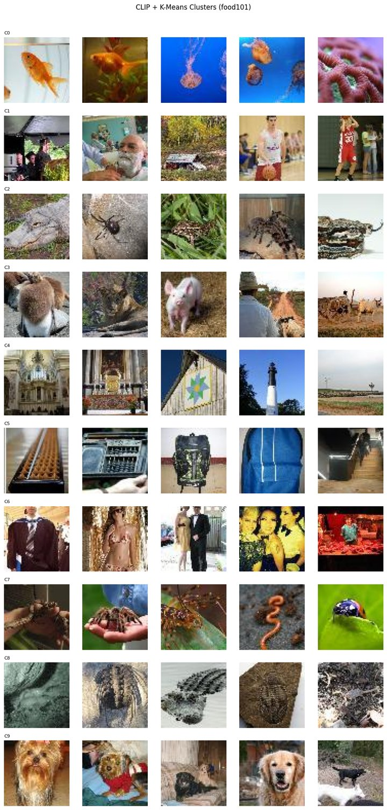

# Applied Deep Learning

Six self-contained PyTorch projects, each a single Jupyter notebook. They cover training a model
from scratch, interpreting a pretrained model, optimizing inference, deploying to the edge,
clustering images with embeddings, and fine-tuning.

## Featured project: Photo clustering with CLIP and k-means

[day5-photo-clustering](day5-photo-clustering/)

Groups an unlabeled set of photos into semantically coherent albums such as beaches, food, people,
and pets. Each image is encoded with CLIP (ViT-B/32) into a 512-dimensional embedding. The
embeddings are L2-normalized so k-means clusters by cosine similarity, the cluster count k is
chosen with the elbow method (using a PCA projection to 50 dimensions to get a usable signal in
high-dimensional space), and the result is rendered as a per-cluster image grid and a 2D t-SNE map.
The notebook also covers running this at scale: per-user clustering, FAISS, MiniBatchKMeans, and a
distributed task queue.

<p align="center">
  
</p>

<p align="center"><sub>Each row is one k-means cluster. Full-size version in the <a href="day5-photo-clustering/">project folder</a>.</sub></p>

## Projects

| # | Project | Description |
|---|---------|-------------|
| 1 | [day1-mlp-mnist](day1-mlp-mnist/) | An MLP built from scratch on MNIST: the full training loop, dropout, optimizers, and error analysis. Reaches 98.1% test accuracy. |
| 2 | [day2-resnet-features](day2-resnet-features/) | ResNet-18 inference plus feature-map visualization through forward hooks, showing what the early convolutional layers respond to. |
| 3 | [day3-onnx-serving](day3-onnx-serving/) | Export to ONNX, serve over FastAPI, and benchmark latency. ONNX Runtime runs about 2x faster than PyTorch on CPU (PyTorch 97 ms, ONNX Runtime 45 ms). Includes why dynamic INT8 quantization gives little benefit for CNNs on CPU. |
| 4 | [day4-coreml](day4-coreml/) | Convert a PyTorch model to CoreML (`.mlpackage`) through TorchScript, with parity validation (max-diff and `np.allclose`) confirming the converted model matches the original. |
| 5 | [day5-photo-clustering](day5-photo-clustering/) | CLIP embeddings plus k-means to group photos into albums with no labels. See the featured section above. |
| 6 | [day6-finetune](day6-finetune/) | Transfer learning on MobileNetV2: feature extraction versus progressive unfreezing with differential learning rates. On this small, near-ImageNet task, feature extraction scored higher than fine-tuning (test macro-F1 0.9917 vs 0.9833). |

## What's covered

A guide to the topics across the six projects:

- Training: building and training a network from scratch (day1)
- Model interpretation: inspecting the intermediate activations of a pretrained model (day2)
- Inference optimization: export, serving, and latency benchmarking (day3)
- Edge deployment: converting to a device-native format with parity checks (day4)
- Embeddings and clustering: representing images as vectors and grouping them, with notes on scaling (day5)
- Fine-tuning: adapting a pretrained model and comparing it against feature extraction (day6)

## Tech stack

`PyTorch` · `torchvision` · `ONNX` / `ONNX Runtime` · `coremltools` · `OpenAI CLIP` ·
`scikit-learn` · `FastAPI` · `matplotlib` · `numpy`

## Repo structure

```
.
├── day1-mlp-mnist/         # MLP from scratch, MNIST, training loop
├── day2-resnet-features/   # ResNet-18 inference + feature-map viz
├── day3-onnx-serving/      # ONNX export + FastAPI + latency benchmark
├── day4-coreml/            # CoreML conversion + parity validation
├── day5-photo-clustering/  # CLIP embeddings + k-means album generation
├── day6-finetune/          # MobileNet fine-tuning, augmentation, F1
├── LEARN.md                # Concept notes for each project
└── README.md
```

## Getting started

Each project is independent and has its own `requirements.txt`.

```bash
# 1. create and activate a virtual environment
python -m venv .venv
source .venv/bin/activate        # Windows: .venv\Scripts\activate

# 2. install one project's dependencies and open it
cd day5-photo-clustering
pip install -r requirements.txt
jupyter notebook
```

Each project folder has its own README with run instructions and output. Note that day4 (CoreML)
needs a Unix-based environment; see its README.

## Data and models

To keep the repo small, datasets and trained model artifacts are not committed. They regenerate
when you run the notebooks.

- Datasets (MNIST, Oxford-IIIT Pet, CLIP demo images) download automatically on first run. The
  exception is `day2-resnet-features/data/Amy.jpg`, a sample photo committed so day 2 runs without
  setup.
- Model artifacts (`.pt`, `.pth`, `.onnx`, `.mlpackage`) are produced by running the notebooks.
  Each notebook keeps its result cells (metrics, plots, visualizations) inline.

## Notes

[LEARN.md](LEARN.md) collects the key concepts and design decisions behind each project.
