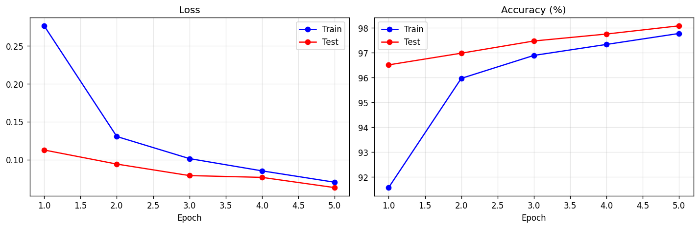

# Day 1: MLP from scratch on MNIST

A multi-layer perceptron trained on MNIST handwritten digits, implementing the full PyTorch
training loop directly, without a high-level training wrapper.

## What it does

- Loads MNIST with `torchvision`, normalizes with the dataset mean and std, and batches with a `DataLoader`.
- Defines an MLP (`Flatten`, `Linear`, `ReLU`, `Dropout`, `Linear`) as an `nn.Module`.
- Trains with the explicit loop: zero the gradients, forward pass, compute loss, backward pass, optimizer step.
- Runs error analysis on misclassified digits and saves the trained weights with `state_dict`.
- Includes notes on logits versus softmax, `model.train()` versus `model.eval()`, why gradients are
  zeroed first, and how SGD, momentum, Adam, and AdamW differ.

## How to run

```bash
pip install -r requirements.txt
jupyter notebook day1_mlp_mnist.ipynb
```

MNIST downloads to `data/` on first run.

## Output

98.1% test accuracy after 5 epochs on CPU (about 5 minutes), with loss dropping every epoch and no
overfitting.


