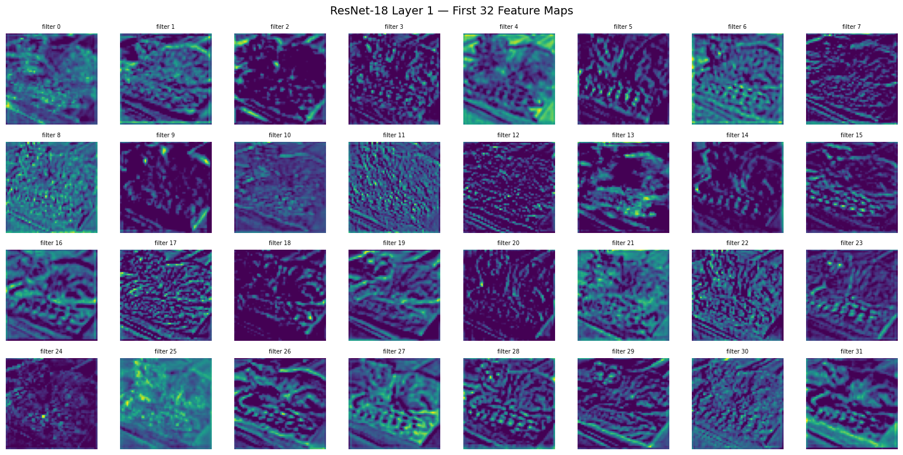

# Day 2: ResNet-18 inference and feature-map visualization

Inference with a pretrained ResNet-18, then a look inside the network at what its convolutional
layers respond to.

## What it does

- Loads ResNet-18 with ImageNet weights and the matching preprocessing (`Resize(256)`,
  `CenterCrop(224)`, ImageNet normalization).
- Runs classification on a sample image and reads the top-5 predictions.
- Attaches a forward hook to an early convolutional layer to capture its feature maps, then plots
  the individual filter activations.
- Includes notes on the input contract and why a normalization mismatch is a silent bug,
  `model.eval()` versus `torch.no_grad()`, and BatchNorm behavior at train versus inference time.

## How to run

```bash
pip install torch torchvision numpy matplotlib pillow
jupyter notebook day2_resnet_features.ipynb
```

A sample photo is included at `data/Amy.jpg`, so the notebook runs without extra setup. The
pretrained weights download on first use.

## Output

The first 32 feature maps from ResNet-18's first layer. Different filters respond to different
low-level patterns: edges, color gradients, and texture.


