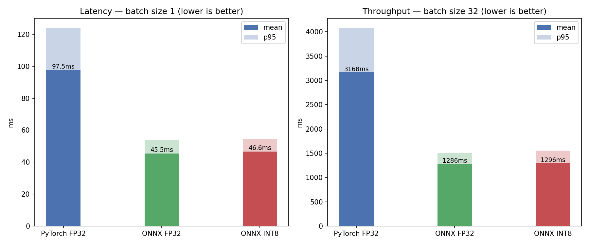

# Day 3: ONNX export, FastAPI serving, and latency benchmark

Exports a PyTorch model to ONNX, serves it over HTTP with FastAPI, and measures latency.

## What it does

- Exports ResNet-18 to ONNX with `torch.onnx.export`, using a dynamic batch axis, named inputs and
  outputs, and `onnx.checker` validation.
- Runs it under ONNX Runtime and benchmarks against PyTorch with warm-up runs, `perf_counter`,
  mean and p95, and both latency and throughput.
- Serves predictions through a FastAPI endpoint (`server.py`) that accepts image uploads.
- Benchmarks dynamic INT8 quantization and documents why it gives little benefit for CNNs on CPU:
  ONNX Runtime's CPU provider only quantizes `MatMul` and `Gemm`, not `Conv`.

## How to run

```bash
pip install torch torchvision onnx onnxruntime fastapi uvicorn python-multipart pillow numpy matplotlib

# notebook (export + benchmark)
jupyter notebook day3_onnx_serving.ipynb

# serve (after the notebook has produced the .onnx file)
uvicorn server:app --reload
# then POST an image to the endpoint, or use the docs at /docs
```

The `.onnx` files are not committed; running the notebook regenerates them.

## Output

ONNX Runtime runs about 2x faster than PyTorch on CPU (mean latency 97 ms versus 45 ms for
ResNet-18), because it is inference-only and fuses ops such as Conv, BatchNorm, and ReLU at load time.


