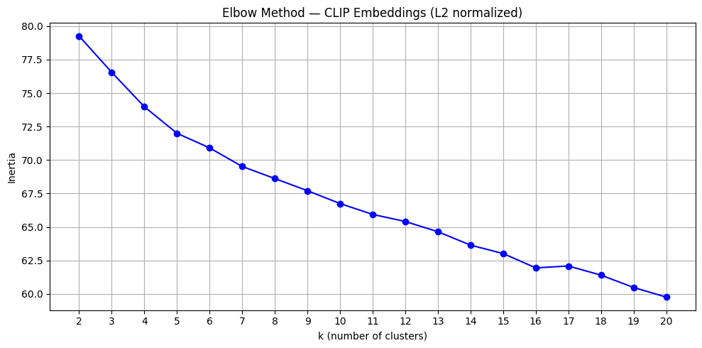
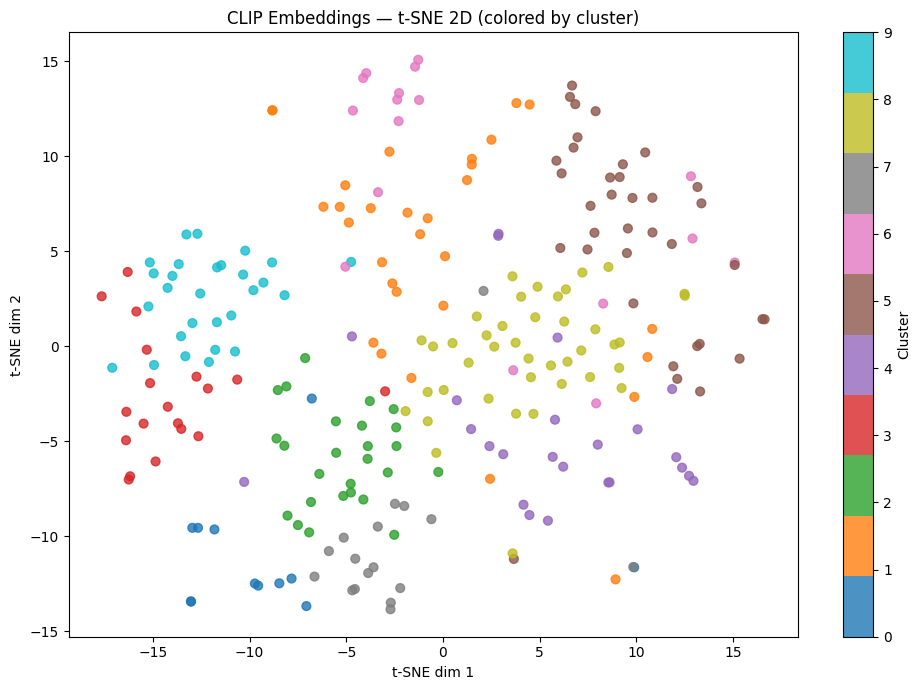

# Day 5: CLIP embeddings and k-means photo clustering

Groups an unlabeled set of photos into semantically coherent albums such as beaches, food, people,
and pets, with no labels.

## What it does

- Encodes each image with CLIP (`ViT-B/32`) into a 512-dimensional semantic embedding.
- L2-normalizes the embeddings and clusters them with k-means (equivalent to cosine similarity
  after normalization).
- Chooses the cluster count k with the elbow method. In 512 dimensions the elbow is not visible
  directly, so a PCA projection to 50 dimensions is used to make it readable.
- Renders the results as per-cluster image grids and a 2D t-SNE projection.
- Covers scaling the pipeline: per-user clustering, FAISS, MiniBatchKMeans, vector databases,
  multi-signal clustering (CLIP plus timestamp, GPS, and faces), and distributed task queues.

## How to run

```bash
pip install -r requirements.txt
jupyter notebook day5-clip-clustering.ipynb
```

Demo images download on first run.

## Output

Each row of the grid is one k-means cluster over the CLIP embeddings.


The elbow plot is used to choose k. Inertia falls smoothly, so a clear elbow needs the PCA step
described above.



t-SNE projects the 512-dimensional embeddings to 2D, colored by cluster, as a visual check that the
clusters are separated.



Dataset diversity matters as much as the algorithm: a single-domain set produces no cluster gaps
because the gaps do not exist in the data, while a set spanning several domains separates cleanly.
