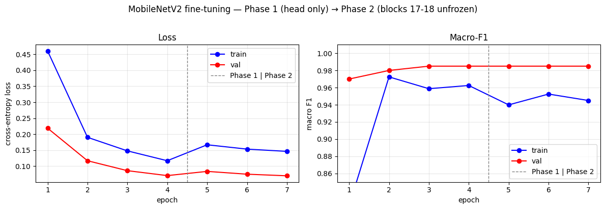

# Day 6: Transfer learning and fine-tuning MobileNetV2

Adapts an ImageNet-pretrained MobileNetV2 to a binary cat versus dog task (Oxford-IIIT Pet),
comparing two transfer-learning strategies and measuring whether the more aggressive one helps.

## What it does

- Swaps MobileNetV2's 1000-class head for a fresh `Linear(1280, 2)`.
- Phase 1, feature extraction: freezes the backbone (both the `requires_grad` lock and the BatchNorm
  running-stat lock) and trains only the head.
- Phase 2, fine-tuning: progressively unfreezes the last two blocks and trains them with a
  differential learning rate (a small rate on the backbone, a larger one on the head), rebuilding the
  optimizer because its parameter list is fixed at construction time.
- Splits train, validation, and test correctly, checkpoints on best validation macro-F1, and
  compares the two phases on the held-out test set.
- Includes training-only data augmentation, loss versus F1, precision and recall, and an analysis of
  Adam's instability at the phase boundary.

## How to run

```bash
pip install torch torchvision numpy matplotlib scikit-learn
jupyter notebook day6-finetune.ipynb
```

Oxford-IIIT Pet downloads on first run.

## Output

| | Phase 1 (head only) | Phase 2 (fine-tuned) | Difference |
|---|---|---|---|
| Test macro-F1 | 0.9917 | 0.9833 | -0.0083 |

Fine-tuning scored lower than feature extraction here. On a small dataset for a task that sits
inside ImageNet's distribution, feature extraction had already nearly solved it, and unfreezing
about 40% of the parameters on 800 images moved the pretrained weights away from a good state. For a
near-distribution task with a small dataset, feature extraction can match or exceed fine-tuning, so
the two are worth comparing directly rather than assuming more trainable capacity helps.

The training curves below also show Adam's loss spike at the Phase 1 to Phase 2 boundary, where the
rebuilt optimizer starts from zeroed momentum.


